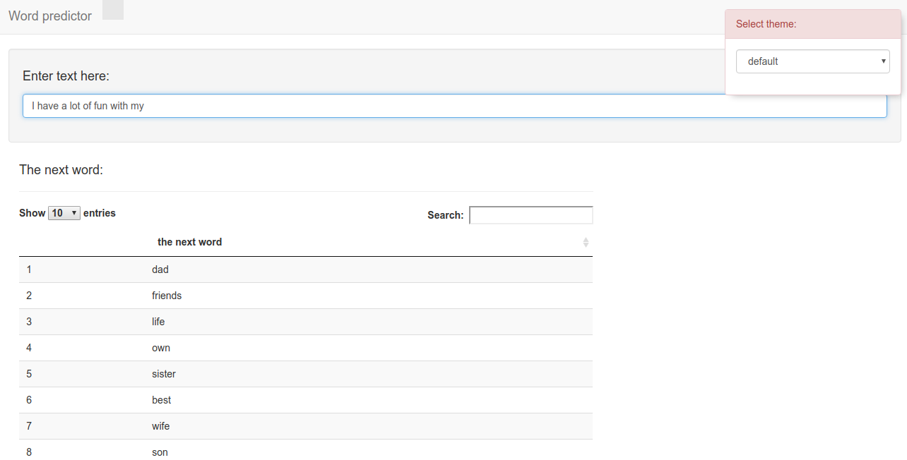

WordPredictor
========================================================
author: Yangang Chen
date: September 5, 2017
autosize: true

Overview of My App
========================================================

* Motivation:

Word prediction software can help a user during word processing by predicting a word the user intends to type. Predictions are based on the text data provided by SwiftKey.

* Objective:

Developing a word prediction software with satisfying accuracy and short response time.

* Link to the app:

https://yangangchen.shinyapps.io/WordPredictor

My Shiny App Interface
========================================================

Key Steps of App Development
========================================================

* Data exploration and data cleaning: http://rpubs.com/yangangchen/ExploratoryTextMining

* Constructing frequency tables of n-grams (n=2,3,4,5)

* Prediction algorithm: Stupid backoff algorithm

  - Examing the last (n-1) input words, check the frequency table of n-gram table, and predict the next word according to the frequency table.
  
  - Then examing the last (n-2), (n-3), ... input words and repeat the previous process.
  
  - Reference: https://web.stanford.edu/~jurafsky/slp3/4.pdf
  
Performance of My App
========================================================

* My word predictor can predict the next word the user intends to type with high accuracy. Examples:
  
  - I don't (top predictions: know, think, want, ...)

  - I have a lot of fun with my (top predictions: dad, friends, life ...)

  - This is a great (top predictions: day, way, thing, ...)

* My word predictor gives predictions within milliseconds.

* Future improvement:

  - Inputting words by clicking words on the screen.
     
  - Storing streaming data from the user and personalize the predictor.
