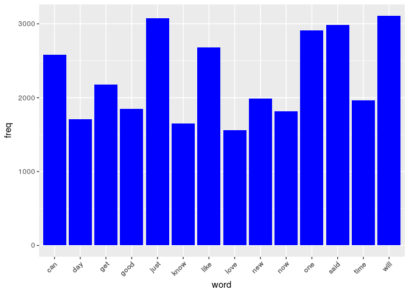

# Exploratory Text Mining
Yangang Chen  

**In this report I perform exploratory text mining on a set of English texts from twitter, blogs and news. The text data is provided by SwiftKey. I show some basic features of the texts (corpus), including line counts, word frequency, word correlation, etc.**

## Introduction


Text entry interface is essential when we use computers and mobile phones. We hope that when we type a few words, before finishing a sentence, out text entry interface can predict which words we will type next. This will make text entry faster and more accurate.

Data science, as a rising star today, provides a powerful tool for building such predictive model. The basic idea of building such model is to

* collect relevant data from the real life (in our case, English texts from twitter, blogs, news, etc.), 
* process the data such that it is suitable for mathematical analysis,
* implement machine learning algorithm on these data, which gives rise to a predictive model,
* use the model to predict upcoming words for text entry, and
* develop a product based on the predictive model.

In this report I perform exploratory text mining on a set of English texts from twitter, blogs and news, which serves as a foundation for machine learning and final data product. The text data is provided by SwiftKey.

Here are the libraries needed in this report:

```r
library(data.table)
library(tm)
library(wordcloud)
library(ggplot2)
library(SnowballC)
```

## Loading the Data

I first set the root working directory:

```r
rm(list=ls())
rootdirname <- "~/[Programming] Data Science - R/[10] Capstone Project/Data"
rootdirname_linux <- "~/\\[Programming\\]\\ Data\\ Science\\ -\\ R/\\[10\\]\\ Capstone\\ Project/Data/"
setwd(rootdirname)
```


Then I download the SwiftKey text data to the root directory, unzip the data, and rename the unzipped directory from "final" to "RawData"

```r
unzip("Coursera-SwiftKey.zip")
file.rename("final", "RawData")
```

I am interested in the data inside the directory "RawData/en_US", which contains three files:

* Texts from twitter: "RawData/en_US/en_US.twitter.txt"
* Texts from blogs: "RawData/en_US/en_US.blogs.txt"
* Texts from news: "RawData/en_US/en_US.news.txt"

Considering that the sizes of the files are very big (hundreds of megabytes), I decide to use "fread" from the package "data.table" to read the files. "fread" is one of the fastest data readers for big files. However, some special characters, such as "\0", will prevent a naive implementation of "fread". Hence, I consider using Linux pipeline command
```
cat %s%s | tr -d '\\000'
# Linux pipeline: cat %s%s | tr -d '\\000'
# 1. Read the file %s%s to the stdout
# 2. From the stdout, delete the special character '\0'
# Note: tr string1 string2: replace string1 by string2 in a text
#       tr -d string1: delete string1 from a text
```
to delete such special characters when I use "fread":

```r
data_twitter <- fread(sprintf("cat %s%s | tr -d '\\000'", rootdirname_linux,
                              "RawData/en_US/en_US.twitter.txt"),
                      header = FALSE, sep = "\n")
```

```
## 
Read 29.2% of 2360148 rows
Read 46.2% of 2360148 rows
Read 69.1% of 2360148 rows
Read 81.4% of 2360148 rows
Read 89.0% of 2360148 rows
Read 2360052 rows and 1 (of 1) columns from 0.156 GB file in 00:00:07
```

```r
data_blogs <- fread(sprintf("cat %s%s | tr -d '\\000'", rootdirname_linux,
                            "RawData/en_US/en_US.blogs.txt"),
                    header = FALSE, sep = "\n")
```

```
## 
Read 38.9% of 899288 rows
Read 72.3% of 899288 rows
Read 899049 rows and 1 (of 1) columns from 0.196 GB file in 00:00:05
```

```r
data_news <- fread(sprintf("cat %s%s | tr -d '\\000'", rootdirname_linux,
                           "RawData/en_US/en_US.news.txt"),
                   header = FALSE, sep = "\n")
```

```
## 
Read 28.7% of 1010242 rows
Read 54.4% of 1010242 rows
Read 75.2% of 1010242 rows
Read 96.0% of 1010242 rows
Read 1010228 rows and 1 (of 1) columns from 0.192 GB file in 00:00:08
```

## Quick look of the Data

Let us have a quick look of the data. For instance, I check "data_twitter" with

```r
head(data_twitter)
```

```
##                                                                                                                 V1
## 1:   How are you? Btw thanks for the RT. You gonna be in DC anytime soon? Love to see you. Been way, way too long.
## 2: When you meet someone special... you'll know. Your heart will beat more rapidly and you'll smile for no reason.
## 3:                                                                        they've decided its more fun if I don't.
## 4:                            So Tired D; Played Lazer Tag & Ran A LOT D; Ughh Going To Sleep Like In 5 Minutes ;)
## 5:                                                 Words from a complete stranger! Made my birthday even better :)
## 6:                                   First Cubs game ever! Wrigley field is gorgeous. This is perfect. Go Cubs Go!
```

```r
summary(data_twitter)
```

```
##       V1           
##  Length:2360052    
##  Class :character  
##  Mode  :character
```
This shows the first few lines of the texts in "en_US.twitter.txt", and also that

* "en_US.twitter.txt" has 2360052 lines.

Similarly, I see that

* "en_US.blogs.txt" has 899049 lines, and
* "en_US.news.txt" has 1010228 lines.

How long is the longest twitter? We can use "nchar" to count the number of characters in each line as follows:

```r
char_count <- apply(data_twitter,1,nchar)
max(char_count)
```
```
## [1] 1795
```
So the longest line has 1795 characters.

The twitter file seems to have something to do with biostatistics. Is there any line that contains the word "biostats"? Let us check it:

```r
data_twitter[apply(data_twitter, 1, function (x) grepl('biostats',x)),]
```
```
##                                                                             V1
## 1: i know how you feel.. i have biostats on tuesday and i have yet to study =/
```
So it shows that a student is still not fully prepared for his/her biostats exam.

## Sampling the Data

We note that the three files are very large, which can take a very long time to process. Also, it is unnecessary to process all the three files thoroughly to produce a reasonable predictive model. Considering these, I will sample 1% of the texts from these files, and process the samples instead:

```r
set.seed(100)
data_twitter_sample <- data_twitter[sample(1:nrow(data_twitter), 0.01*nrow(data_twitter)), ]
data_blogs_sample <- data_blogs[sample(1:nrow(data_blogs), 0.01*nrow(data_blogs)), ]
data_news_sample <- data_news[sample(1:nrow(data_news), 0.01*nrow(data_news)), ]
```
For reproducibility, I set the seed to 100, and save the samples into new files:

```r
write.table(data_twitter_sample, "./SampleData/en_US/en_US.twitter_sample.txt", sep="\n",
            row.name=FALSE, col.name=FALSE)
write.table(data_blogs_sample, "./SampleData/en_US/en_US.blogs_sample.txt", sep="\n",
            row.name=FALSE, col.name=FALSE)
write.table(data_news_sample, "./SampleData/en_US/en_US.news_sample.txt", sep="\n",
            row.name=FALSE, col.name=FALSE)
```

## Processing the Data

Before a predictive model can be built, the texts need to be processed. A very powerful tool for text processing is the R package "tm" (text mining). I will recommend interested readers to the following tutorials:

* https://rstudio-pubs-static.s3.amazonaws.com/31867_8236987cf0a8444e962ccd2aec46d9c3.html
* https://cran.r-project.org/web/packages/tm/tm.pdf
* ftp://cran.r-project.org/pub/R/web/packages/tm/vignettes/tm.pdf

Following the tutorials, I start with loading the texts using a "tm" function "Corpus", which converts the texts to a special type of data structure "corpus". A corpus a large and structured set of texts (nowadays usually electronically stored and processed). They are used to do statistical analysis and hypothesis testing, checking occurrences or validating linguistic rules within a specific language territory.

```r
dirname <- paste(rootdirname, '/SampleData/en_US', sep="")
docs <- Corpus(DirSource(dirname))
```

To check the texts inside the corpus, we can use

```r
head(as.character(docs[[2]]))
```

```
## [1] "\"Michigan taxpayers were particularly outraged because of Clayton's seeming sense of entitlement. Detroit-area TV station Local 4 -- which broke the story -- caught up with Clayton as she was packing up her belongings from one home to move to another home. (She'd bought the new abode -- along with a new car -- using cash from her lottery winnings.)\""                                             
## [2] "\"Verizon bought the rights to use the frequencies from the government for $4.4 billion in 2008. They were formerly used by UHF TV stations.\""                                                                                                                                                                                                                                                                
## [3] "\"25 small tortillas, warm\""                                                                                                                                                                                                                                                                                                                                                                                  
## [4] "\"\\\"People don't ride buses,\\\" May said.\""                                                                                                                                                                                                                                                                                                                                                                
## [5] "\"On Senior Night against Duke, all the senior members of the Steel started and left with a 3-0 lead.\""                                                                                                                                                                                                                                                                                                       
## [6] "\"According to a history compiled by legendary architecture writer Esther McCoy in documents now stored with the Library of Congress, Dodge sold his house to T. Morrison McKenna and Anita K. McKenna in 1924 for $125,000. To their objection, the Los Angeles High School District condemned the property in 1939, and with a $69,000 payment to the McKennas, the district took control of the property.\""
```

My goal is to clean up the corpus for mathematical analysis. To do this, I first convert all capital letters to lowercase letters in the corpus:

```r
docs <- tm_map(docs, tolower)
```

I remove numbers in the corpus:

```r
docs <- tm_map(docs, removeNumbers)
```

In English there are lots of "stopwords", or common words, that do not have much analytic value, such as

```r
head(stopwords("english"))
```

```
## [1] "i"      "me"     "my"     "myself" "we"     "our"
```
I remove these words from the corpus as well:

```r
docs <- tm_map(docs, removeWords, c(stopwords("english")))
```

I also consider removing all the puctuations:

```r
docs <- tm_map(docs, removePunctuation)
```

Sometimes it may be useful to remove some other special characters. To give an example:

```r
for(j in seq(docs)) {
    docs[[j]] <- gsub("/", " ", docs[[j]])
}
```
However, it is unnecessary to implement this for our texts, since special characters have been removed in the previous steps.

In English, lots of words, such as "eat", "eats" and "eating", have the same roots (stems). To make the corpus cleaner, I convert them to their stems:

```r
docs <- tm_map(docs, stemDocument, language = "english")
```

The previous steps create a lot of whitespaces, which can be removed by

```r
docs <- tm_map(docs, stripWhitespace)
```

The previous steps may have changed the data type of corpus. To recover the preprocessed documents as corpus data type, I use

```r
docs <- tm_map(docs, PlainTextDocument)
```

Finally, let us check what the corpus looks like now:

```r
head(as.character(docs[[2]]))
```

```
## [1] "michigan taxpayers particularly outraged claytons seeming sense entitlement detroitarea tv station local broke story caught clayton packing belongings one home move another home bought new abode along new car using cash lottery win"                                      
## [2] "verizon bought rights use frequencies government billion formerly used uhf tv st"                                                                                                                                                                                             
## [3] " small tortillas warm"                                                                                                                                                                                                                                                        
## [4] "people ride buses may said"                                                                                                                                                                                                                                                   
## [5] " senior night duke senior members steel started left lead"                                                                                                                                                                                                                    
## [6] "according history compiled legendary architecture writer esther mccoy documents now stored library congress dodge sold house t morrison mckenna anita k mckenna objection los angeles high school district condemned property payment mckennas district took control properti"
```
We can see that the corpus becomes much cleaner now and contains mostly stem words.

To conclude the data preprocessing, I save the corpus into three files "PreprocessedData/en_US1.txt",  "PreprocessedData/en_US2.txt" and "PreprocessedData/en_US3.txt":

```r
for(j in seq(docs)) {
    filename_j <- sprintf('en_US%s.txt',j)
    writeCorpus(docs[j], path = './PreprocessedData/en_US', filename = filename_j)
}
```

## Exploration of Data

Once the texts are cleaned up, it becomes possible to perform some mathematical analysis on them. In particular, "DocumentTermMatrix" is a matrix-like data type that stores unique words in the corpus and their relevant information, such as word frequencies, word correlations, etc. I can construct a DocumentTermMatrix "dtm" using

```r
dtm <- DocumentTermMatrix(docs)
```

I can check the dimension of the matrix as follows

```r
dim(as.matrix(dtm))
```

```
## [1]     3 56814
```
As expected, the matrix has a big size. To simplify the analysis, I focus on the words that appear frequently by keeping only the important part of the matrix:

```r
dtms <- removeSparseTerms(dtm, 0.1) # This makes a matrix that is 10% empty space, maximum.
dim(as.matrix(dtms))
```

```
## [1]    3 9812
```
Now the size of the matrix is reduced to around 3x10000.

Using the new DocumentTermMatrix "dtms", I can count word frequencies by

```r
freq <- colSums(as.matrix(dtms))
freq <- freq[order(-freq)]
```
where I have reorder the unique words from the highest frequency to the lowest.

The following checks the number of unique words in the corpus:

```r
length(freq)
```

```
## [1] 9812
```

To check the 20th most frequent words in the corpus, I use

```r
head(freq,20)
```

```
##   will   just   said    one   like    can    get    new   time   good 
##   3107   3072   2983   2911   2683   2578   2179   1987   1961   1850 
##    now    day   know   love people   back    see   make  think   also 
##   1814   1706   1649   1563   1490   1399   1365   1340   1336   1319
```

Since R is good at processing the dataframe type, I convert "freq" to the dataframe type:

```r
wordfreq <- data.frame(word=names(freq), freq=freq)
```
which looks like

```r
head(wordfreq)
```

```
##      word freq
## will will 3107
## just just 3072
## said said 2983
## one   one 2911
## like like 2683
## can   can 2578
```

It is a good idea to visualize the word frequencies by histogram, especially for the most frequent words:

```r
p <- ggplot(subset(wordfreq, freq>1500), aes(word, freq))
p <- p + geom_bar(stat="identity",fill="blue")
p <- p + theme(axis.text.x=element_text(angle=45, hjust=1))
p
```

<!-- -->

Another way of visualizing the word frequencies is to use "wordcloud" figure. The frequency of a word is proposional to the size of the word in a wordcloud figure. In particular, I plot the wordcloud for the 100 most frequent words:

```r
set.seed(100)
wordcloud(names(freq), freq, max.words=100, scale=c(3.5, .01), colors=brewer.pal(6, "Dark2"))
```

<!-- -->

The figure shows that the words like "will" "just" "said" are the most frequent ones. Also, for instance, "school" is one of the 100 most frequent words.

Finally, I also want to check the correlation among the words, or, I want to know which words are more likely to appear together. If words always appear together, then correlation=1.0. For instance, I want to check which words are more likely to appear together with "school":

```r
findAssocs(dtms, c("school"), corlimit=0.999)
```

```
## $school
##     achievement           adams     anniversary           argue 
##               1               1               1               1 
##           audit           avail             ave          banned 
##               1               1               1               1 
##          barnes             bat             bay             bob 
##               1               1               1               1 
##          brewer          burton           buses       campaigns 
##               1               1               1               1 
##       cardinals             ceo        chargers            chef 
##               1               1               1               1 
##         citizen        colleges         compani      contractor 
##               1               1               1               1 
##        crawford          dealer            dean             deb 
##               1               1               1               1 
##          debbie          device      discourage         dispute 
##               1               1               1               1 
##         drivers           ducks            dunn          eighth 
##               1               1               1               1 
##      elementary       engineers            eric         faculty 
##               1               1               1               1 
##          filing         focused        freshman     fundraising 
##               1               1               1               1 
##         georgia           grant         griffin            gulf 
##               1               1               1               1 
##         hancock          hiring        hispanic         hitting 
##               1               1               1               1 
##        holliday         hopkins       hurricane      initiative 
##               1               1               1               1 
##        invested             jan           jerry          jersey 
##               1               1               1               1 
##           judge            june          junior          kansas 
##               1               1               1               1 
##            knee           laura        leverage          limits 
##               1               1               1               1 
##          lineup          locker             los            mart 
##               1               1               1               1 
##        maryland         matchup        mattress        memorial 
##               1               1               1               1 
##           metro        michigan      midfielder           mills 
##               1               1               1               1 
##       minnesota     mississippi           motor          muscle 
##               1               1               1               1 
##        national            nato           parks         payment 
##               1               1               1               1 
##        phillips         phoenix          plates          player 
##               1               1               1               1 
##          pledge        portland      presidents      properties 
##               1               1               1               1 
##            pump        quarters             rac        railroad 
##               1               1               1               1 
##  recommendation recommendations           rehab         related 
##               1               1               1               1 
##    representing         request       requested         restaur 
##               1               1               1               1 
##           ridge       rodriguez          rogers             ron 
##               1               1               1               1 
##          rookie             rul             rum         runners 
##               1               1               1               1 
##         rutgers           safer         sanders            sang 
##               1               1               1               1 
##           score        scouting            sean            sept 
##               1               1               1               1 
##         serving             sgt         shelter           shows 
##               1               1               1               1 
##            solo        sponsors         stadium            sued 
##               1               1               1               1 
##           surge        suspects         teacher        teachers 
##               1               1               1               1 
##       temporary           tests         theatre             tom 
##               1               1               1               1 
##         trigger            ucla       valentine         vendors 
##               1               1               1               1 
##        veterans           walks 
##               1               1
```
This list shows that "school" is likely to appear together with "achievement", "audit", etc.
