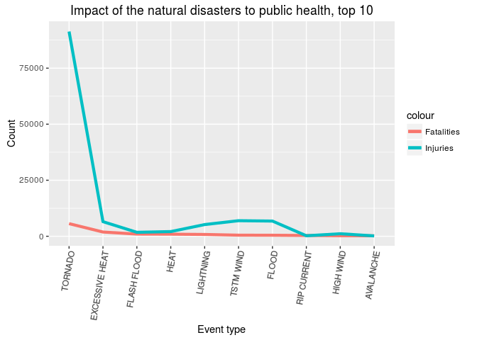
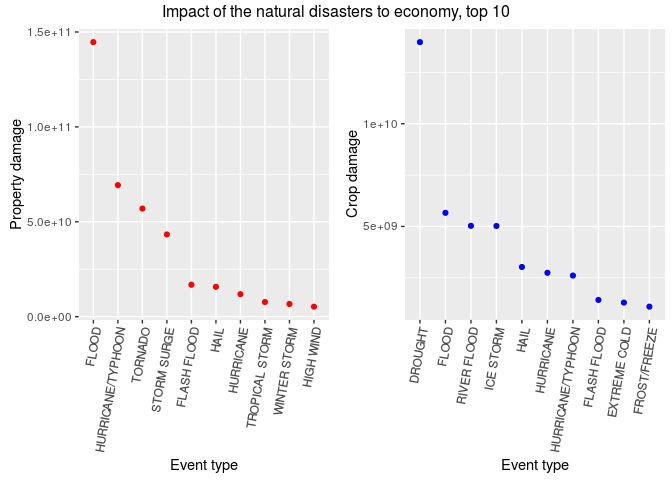

# The Impact of the Natural Disasters to Population Health and Economy in the United States
Yangang Chen  

Published on http://rpubs.com/yangangchen/NaturalDisasters

**Synopsis**

**This report studies the Impact of the Natural Disasters to Population Health and Economy in the United States. The tool of this report is data analysis using R and Rstudio. The results show that the natural disasters that causes the biggest threat to public health are tornado, excessive heat, heat, flood, flash flood, tstm wind, lightening, etc, while the natural disasters that causes the biggest threat to economy are flood, draught, hurricane/typhoon, tornado, storm surge, river flood, flash flood, etc.**


This reports involves exploring the U.S. National Oceanic and Atmospheric Administration's (NOAA) storm database. This database tracks characteristics of major storms and weather events in the United States, including when and where they occur, as well as estimates of any fatalities, injuries, and property damage.

Here are the libraries needed for this report:

```r
library(knitr)
library(data.table)
library(ggplot2)
library(gridExtra)
```

## Section 1: Data Processing

First I download the data:

```r
FileUrl <- "https://d396qusza40orc.cloudfront.net/repdata%2Fdata%2FStormData.csv.bz2"
download.file(FileUrl,destfile = "StormData.csv.bz2")
```
Then I read the data using "fread". "fread" is a fast data reader and the resulting data type is "data.table".

```r
data <- fread(sprintf("bzcat %s | tr -d '\\000'", "StormData.csv.bz2"),verbose=TRUE)
```

```
## Input contains no \n. Taking this to be a filename to open
## File opened, filesize is 0.523066 GB.
## Memory mapping ... ok
## Detected eol as \r\n (CRLF) in that order, the Windows standard.
## Positioned on line 1 after skip or autostart
## This line is the autostart and not blank so searching up for the last non-blank ... line 1
## Detecting sep ... ','
## Detected 37 columns. Longest stretch was from line 1 to line 30
## Starting data input on line 1 (either column names or first row of data). First 10 characters: "STATE__",
## All the fields on line 1 are character fields. Treating as the column names.
## Count of eol: 1307675 (including 1 at the end)
## Count of sep: 34819802
## nrow = MIN( nsep [34819802] / ncol [37] -1, neol [1307675] - nblank [1] ) = 967216
## Type codes (   first 5 rows): 3444344430000303003343333430000333303
## Type codes (+ middle 5 rows): 3444344434444303443343333434440333343
## Type codes (+   last 5 rows): 3444344434444303443343333434444333343
## Type codes: 3444344434444303443343333434444333343 (after applying colClasses and integer64)
## Type codes: 3444344434444303443343333434444333343 (after applying drop or select (if supplied)
## Allocating 37 column slots (37 - 0 dropped)
## 
Read 22.7% of 967216 rows
Read 44.5% of 967216 rows
Read 57.9% of 967216 rows
Read 76.5% of 967216 rows
Read 83.7% of 967216 rows
Read 902297 rows and 37 (of 37) columns from 0.523 GB file in 00:00:08
##    0.035s (  0%) Memory map (rerun may be quicker)
##    0.000s (  0%) sep and header detection
##    0.730s ( 10%) Count rows (wc -l)
##    0.000s (  0%) Column type detection (first, middle and last 5 rows)
##    0.600s (  9%) Allocation of 902297x37 result (xMB) in RAM
##    5.659s ( 80%) Reading data
##    0.000s (  0%) Allocation for type bumps (if any), including gc time if triggered
##    0.000s (  0%) Coercing data already read in type bumps (if any)
##    0.013s (  0%) Changing na.strings to NA
##    7.037s        Total
```
Let us have a look of the data:

```r
head(data)
```

```
##    STATE__           BGN_DATE BGN_TIME TIME_ZONE COUNTY COUNTYNAME STATE
## 1:       1  4/18/1950 0:00:00     0130       CST     97     MOBILE    AL
## 2:       1  4/18/1950 0:00:00     0145       CST      3    BALDWIN    AL
## 3:       1  2/20/1951 0:00:00     1600       CST     57    FAYETTE    AL
## 4:       1   6/8/1951 0:00:00     0900       CST     89    MADISON    AL
## 5:       1 11/15/1951 0:00:00     1500       CST     43    CULLMAN    AL
## 6:       1 11/15/1951 0:00:00     2000       CST     77 LAUDERDALE    AL
##     EVTYPE BGN_RANGE BGN_AZI BGN_LOCATI END_DATE END_TIME COUNTY_END
## 1: TORNADO         0                                               0
## 2: TORNADO         0                                               0
## 3: TORNADO         0                                               0
## 4: TORNADO         0                                               0
## 5: TORNADO         0                                               0
## 6: TORNADO         0                                               0
##    COUNTYENDN END_RANGE END_AZI END_LOCATI LENGTH WIDTH F MAG FATALITIES
## 1:         NA         0                      14.0   100 3   0          0
## 2:         NA         0                       2.0   150 2   0          0
## 3:         NA         0                       0.1   123 2   0          0
## 4:         NA         0                       0.0   100 2   0          0
## 5:         NA         0                       0.0   150 2   0          0
## 6:         NA         0                       1.5   177 2   0          0
##    INJURIES PROPDMG PROPDMGEXP CROPDMG CROPDMGEXP WFO STATEOFFIC ZONENAMES
## 1:       15    25.0          K       0                                    
## 2:        0     2.5          K       0                                    
## 3:        2    25.0          K       0                                    
## 4:        2     2.5          K       0                                    
## 5:        2     2.5          K       0                                    
## 6:        6     2.5          K       0                                    
##    LATITUDE LONGITUDE LATITUDE_E LONGITUDE_ REMARKS REFNUM
## 1:     3040      8812       3051       8806              1
## 2:     3042      8755          0          0              2
## 3:     3340      8742          0          0              3
## 4:     3458      8626          0          0              4
## 5:     3412      8642          0          0              5
## 6:     3450      8748          0          0              6
```

Our objective is to evaluate the impact of major storms and weather events to the public health and economy. Hence, only the following variables in the data are relevant to our study:
* "EVTYPE": event (natural disaster) type
* "FATALITIES": Fatalities
* "INJURIES": Injuries
* "PROPDMG": Property damage
* "PROPDMGEXP": The unit of the property damage. "H" is "hundred", "K" is thousand, "M" is million, "B" is billion, and number is "10^{number}".
* "CROPDMG": Crop damage
* "CROPDMGEXP": The unit of the crop damage.

To be concrete, let us see what is inside "PROPDMGEXP" and "CROPDMGEXP":

```r
summary(as.factor(data$PROPDMGEXP))
```

```
##             -      ?      +      0      1      2      3      4      5 
## 465934      1      8      5    216     25     13      4      4     28 
##      6      7      8      B      H      h      K      M      m 
##      4      5      1     40      6      1 424665  11330      7
```

```r
summary(as.factor(data$CROPDMGEXP))
```

```
##             ?      0      2      B      K      k      M      m 
## 618413      7     19      1      9 281832     21   1994      1
```
Hence, I subset the relevant variables as follows:

```r
data <- data[,c("EVTYPE","FATALITIES","INJURIES","PROPDMG","PROPDMGEXP","CROPDMG","CROPDMGEXP"),
              with=FALSE]
```
Now let us look as the data again. The size of the data is smaller.

```r
head(data)
```

```
##     EVTYPE FATALITIES INJURIES PROPDMG PROPDMGEXP CROPDMG CROPDMGEXP
## 1: TORNADO          0       15    25.0          K       0           
## 2: TORNADO          0        0     2.5          K       0           
## 3: TORNADO          0        2    25.0          K       0           
## 4: TORNADO          0        2     2.5          K       0           
## 5: TORNADO          0        2     2.5          K       0           
## 6: TORNADO          0        6     2.5          K       0
```

```r
summary(data)
```

```
##     EVTYPE            FATALITIES          INJURIES        
##  Length:902297      Min.   :  0.0000   Min.   :   0.0000  
##  Class :character   1st Qu.:  0.0000   1st Qu.:   0.0000  
##  Mode  :character   Median :  0.0000   Median :   0.0000  
##                     Mean   :  0.0168   Mean   :   0.1557  
##                     3rd Qu.:  0.0000   3rd Qu.:   0.0000  
##                     Max.   :583.0000   Max.   :1700.0000  
##     PROPDMG         PROPDMGEXP           CROPDMG         CROPDMGEXP       
##  Min.   :   0.00   Length:902297      Min.   :  0.000   Length:902297     
##  1st Qu.:   0.00   Class :character   1st Qu.:  0.000   Class :character  
##  Median :   0.00   Mode  :character   Median :  0.000   Mode  :character  
##  Mean   :  12.06                      Mean   :  1.527                     
##  3rd Qu.:   0.50                      3rd Qu.:  0.000                     
##  Max.   :5000.00                      Max.   :990.000
```

Considering that the units of the data, given in "PROPDMGEXP" and "CROPDMGEXP", are not the same, I use the following "Transform"" function to transform the data to unit "1".

```r
Transform <- function(var,varExp) {
    index <- varExp=="H"|varExp=="h"
    var[index] <- var[index]*10^2
    index <- varExp=="K"|varExp=="k"
    var[index] <- var[index]*10^3
    index <- varExp=="M"|varExp=="m"
    var[index] <- var[index]*10^6
    index <- varExp=="B"|varExp=="b"
    var[index] <- var[index]*10^9
    index <- !is.na(as.numeric(varExp))
    var[index] <- var[index]*10^as.numeric(varExp[index])
    return(var)
}

data$PROPDMG <- Transform(data$PROPDMG,data$PROPDMGEXP)
data$CROPDMG <- Transform(data$CROPDMG,data$CROPDMGEXP)
```
Now that the units of "PROPDMG" and "PROPDMG" are the same, I delete "PROPDMGEXP" and "CROPDMGEXP"

```r
data <- data[,c("PROPDMGEXP","CROPDMGEXP"):=NULL]
```
Let us look as the data again. The units of the variables "PROPDMG" and "CROPDMG" are converted to 1.

```r
head(data)
```

```
##     EVTYPE FATALITIES INJURIES PROPDMG CROPDMG
## 1: TORNADO          0       15   25000       0
## 2: TORNADO          0        0    2500       0
## 3: TORNADO          0        2   25000       0
## 4: TORNADO          0        2    2500       0
## 5: TORNADO          0        2    2500       0
## 6: TORNADO          0        6    2500       0
```

```r
summary(data)
```

```
##     EVTYPE            FATALITIES          INJURIES        
##  Length:902297      Min.   :  0.0000   Min.   :   0.0000  
##  Class :character   1st Qu.:  0.0000   1st Qu.:   0.0000  
##  Mode  :character   Median :  0.0000   Median :   0.0000  
##                     Mean   :  0.0168   Mean   :   0.1557  
##                     3rd Qu.:  0.0000   3rd Qu.:   0.0000  
##                     Max.   :583.0000   Max.   :1700.0000  
##     PROPDMG             CROPDMG         
##  Min.   :0.000e+00   Min.   :0.000e+00  
##  1st Qu.:0.000e+00   1st Qu.:0.000e+00  
##  Median :0.000e+00   Median :0.000e+00  
##  Mean   :4.746e+05   Mean   :5.442e+04  
##  3rd Qu.:5.000e+02   3rd Qu.:0.000e+00  
##  Max.   :1.150e+11   Max.   :5.000e+09
```

## Section 2: Results

Next, I use the built-in function "aggregate" to group the data based on the event type, and then for each event type, I compute the sum of the fatalities, injuries, property damages and crop damages.

```r
aggdata <- aggregate(data[,-c("EVTYPE"),with=FALSE],
                     by=list(EVTYPE=data$EVTYPE), FUN=sum, na.rm=TRUE)
```

Now "aggdata" summarizes the total fatalities, injuries, property damages and crop damages for each natural disaster.

```r
head(aggdata)
```

```
##                 EVTYPE FATALITIES INJURIES PROPDMG  CROPDMG
## 1                    ?          0        0    5000        0
## 2       ABNORMALLY DRY          0        0       0        0
## 3       ABNORMALLY WET          0        0       0        0
## 4      ABNORMAL WARMTH          0        0       0        0
## 5 ACCUMULATED SNOWFALL          0        0       0        0
## 6  AGRICULTURAL FREEZE          0        0       0 28820000
```

```r
tail(aggdata)
```

```
##                 EVTYPE FATALITIES INJURIES PROPDMG CROPDMG
## 980 WINTER WEATHER/MIX         28       72 6372000       0
## 981        WINTERY MIX          0        0       0       0
## 982         WINTRY MIX          1       77   10000       0
## 983         Wintry Mix          0        0    2500       0
## 984         Wintry mix          0        0       0       0
## 985                WND          0        0       0       0
```

### Section 2.1: Impact of the natural disasters to public health

I sort "aggdata" by the total fatalities in descending order, and check the top 10 natural disasters that cause the biggest fatalities:

```r
aggdataS1 <- aggdata[order(-aggdata$FATALITIES),]
aggdataS1[1:10,]
```

```
##             EVTYPE FATALITIES INJURIES      PROPDMG    CROPDMG
## 830        TORNADO       5633    91346  56947380676  414953270
## 123 EXCESSIVE HEAT       1903     6525      7753700  492402000
## 147    FLASH FLOOD        978     1777  16822673978 1421317100
## 269           HEAT        937     2100      1797000  401461500
## 452      LIGHTNING        816     5230    930379430   12092090
## 853      TSTM WIND        504     6957   4484928495  554007350
## 163          FLOOD        470     6789 144657709807 5661968450
## 581    RIP CURRENT        368      232         1000          0
## 353      HIGH WIND        248     1137   5270046295  638571300
## 11       AVALANCHE        224      170      3721800          0
```

I sort "aggdata" by the total injuries in descending order, and check the top 10 natural disasters that cause the biggest injuries:

```r
aggdataS2 <- aggdata[order(-aggdata$INJURIES),]
aggdataS2[1:10,]
```

```
##                EVTYPE FATALITIES INJURIES      PROPDMG    CROPDMG
## 830           TORNADO       5633    91346  56947380676  414953270
## 853         TSTM WIND        504     6957   4484928495  554007350
## 163             FLOOD        470     6789 144657709807 5661968450
## 123    EXCESSIVE HEAT       1903     6525      7753700  492402000
## 452         LIGHTNING        816     5230    930379430   12092090
## 269              HEAT        937     2100      1797000  401461500
## 424         ICE STORM         89     1975   3944927860 5022113500
## 147       FLASH FLOOD        978     1777  16822673978 1421317100
## 758 THUNDERSTORM WIND        133     1488   3483122472  414843050
## 238              HAIL         15     1361  15735267513 3025954473
```
This table shows that tornado, excessive heat and flash flood are the top 3 killers.

I visualize the top 10 killers as follows:

```r
aggdataS1 <- aggdata[order(-aggdata$FATALITIES,-aggdata$INJURIES),]
aggdataS1$EVTYPE <- factor(aggdataS1$EVTYPE, levels=unique(aggdataS1$EVTYPE))
ggplot(aggdataS1[1:10,], aes(x=EVTYPE)) + 
    geom_line(aes(y=FATALITIES, group = 1, colour = "Fatalities"), size=1.5) + 
    geom_line(aes(y=INJURIES, group = 1, colour = "Injuries"),size=1.5) +
    theme(axis.text.x = element_text(angle=80, hjust=1)) +
    xlab("Event type") + ylab("Count") + ggtitle("Impact of the natural disasters to public health, top 10")
```

<!-- -->

To summarize, **the natural disasters that causes the biggest threat to public health are tornado, excessive heat, heat, flood, flash flood, tstm wind, lightening, etc.**

### Section 2.2: Impact of the natural disasters to economy

I sort "aggdata" by the total property damages in descending order, and check the top 10 natural disasters that cause the biggest property damages:

```r
aggdataS3 <- aggdata[order(-aggdata$PROPDMG),]
aggdataS3[1:10,]
```

```
##                EVTYPE FATALITIES INJURIES      PROPDMG    CROPDMG
## 163             FLOOD        470     6789 144657709807 5661968450
## 406 HURRICANE/TYPHOON         64     1275  69305840000 2607872800
## 830           TORNADO       5633    91346  56947380676  414953270
## 666       STORM SURGE         13       38  43323536000       5000
## 147       FLASH FLOOD        978     1777  16822673978 1421317100
## 238              HAIL         15     1361  15735267513 3025954473
## 397         HURRICANE         61       46  11868319010 2741910000
## 844    TROPICAL STORM         58      340   7703890550  678346000
## 972      WINTER STORM        206     1321   6688497251   26944000
## 353         HIGH WIND        248     1137   5270046295  638571300
```

I sort "aggdata" by the total crop damages in descending order, and check the top 10 natural disasters that cause the biggest crop damages:

```r
aggdataS4 <- aggdata[order(-aggdata$CROPDMG),]
aggdataS4[1:10,]
```

```
##                EVTYPE FATALITIES INJURIES      PROPDMG     CROPDMG
## 88            DROUGHT          0        4   1046106000 13972566000
## 163             FLOOD        470     6789 144657709807  5661968450
## 586       RIVER FLOOD          2        2   5118945500  5029459000
## 424         ICE STORM         89     1975   3944927860  5022113500
## 238              HAIL         15     1361  15735267513  3025954473
## 397         HURRICANE         61       46  11868319010  2741910000
## 406 HURRICANE/TYPHOON         64     1275  69305840000  2607872800
## 147       FLASH FLOOD        978     1777  16822673978  1421317100
## 132      EXTREME COLD        160      231     67737400  1292973000
## 205      FROST/FREEZE          0        0      9480000  1094086000
```

I visualize the top 10 economic destructors as follows:

```r
aggdataS3$EVTYPE <- factor(aggdataS3$EVTYPE, levels=unique(aggdataS3$EVTYPE))
plot1 <- ggplot(aggdataS3[1:10,], aes(x=EVTYPE,y=PROPDMG)) + 
    geom_point(colour="red") + theme(axis.text.x = element_text(angle=80, hjust=1)) +
    xlab("Event type") + ylab("Property damage")
aggdataS4$EVTYPE <- factor(aggdataS4$EVTYPE, levels=unique(aggdataS4$EVTYPE))
plot2 <- ggplot(aggdataS4[1:10,], aes(x=EVTYPE,y=CROPDMG)) + 
    geom_point(colour="blue") + theme(axis.text.x = element_text(angle=80, hjust=1)) +
    xlab("Event type") + ylab("Crop damage")
grid.arrange(plot1, plot2, ncol=2,
             top="Impact of the natural disasters to economy, top 10")
```

<!-- -->

To summarize, **the natural disasters that causes the biggest threat to economy are flood, draught, hurricane/typhoon, tornado, storm surge, river flood, flash flood, etc.**
