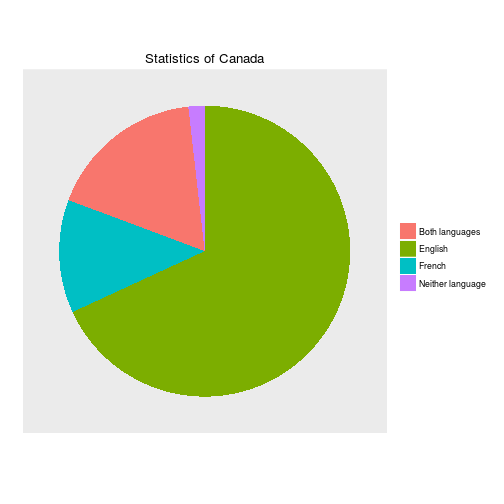

## Overview of the App

* Motivation:

Canada has two official languages: English and French. My Shiny app trys to answer the following questions: Where do Francophone Canadians live? How many Canadians are bilingual? Do people in big cities (e.g. Toronto, Vancouver) speak different languages? ......

* The objective:

Visualize and summarize the population of English/French/both/neither speakers in each city-level division

* The link:

https://yangangchen.shinyapps.io/CanadaLanguage/


---
## Basic Interface

* Part I: Interactive Map

The size of the circles represents the population size for the English/French/both/neither speakers.

The intensity of color of the circles represents the percentage of the chosen speakers among the total population.

The pie chart shows the percentage of the English/French/both/neither speaker in a chosen province/territory.

* Part II: Data Explorer

Search engine for the original data downloaded from Statistics Canada. Very straightforward!


---
## Example: Pie Chart in the Interactive Map


```r
library(ggplot2)
ggplot(data=subdata, aes(x=factor(1), y=Value, fill=Language) ) +
    geom_bar(width=1, stat="identity") +
    coord_polar(theta="y") + ylab("") + xlab("") + labs(fill="") + 
    theme(axis.ticks = element_blank(), panel.grid  = element_blank(), 
          axis.text = element_blank(), legend.position = "right") + 
    ggtitle(paste0("Statistics of ",provinceBy))
```




---
## Conclusions

* The biggest Canadian cities: Toronto, Montreal, Vancouver, Ottawa, Calgary, etc.

* Most of Canadians are anglophone (speak English).

* Most of Francophone Canadians live in the province of Quebec.

* Bilingual Canadians concentrate in Montreal, Ottawa, the border of Quebec/Ontario, and Northern New Brunswick.

* People in big cities (e.g. Toronto, Vancouver) may speak neither official languages.

* There are other interesting discoveries from the app, which will be left for you :)
